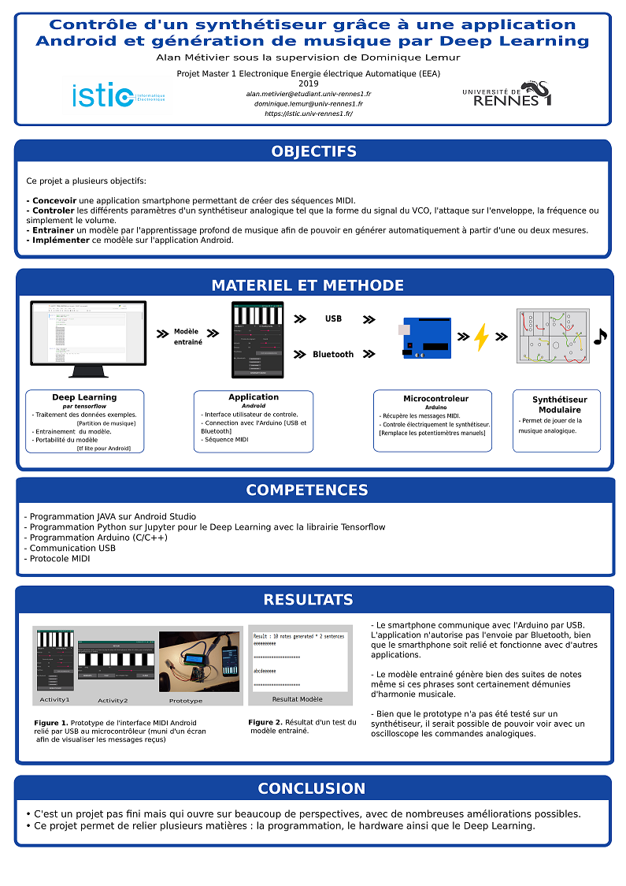

# Android_Arduino_Tensorflow-MIDI2CV
This project starts for Master Degree first year's project. This is a Android application to control a analogic modular synthesizer. I tried also to generate some music with a deep learning model. This is not finish.

